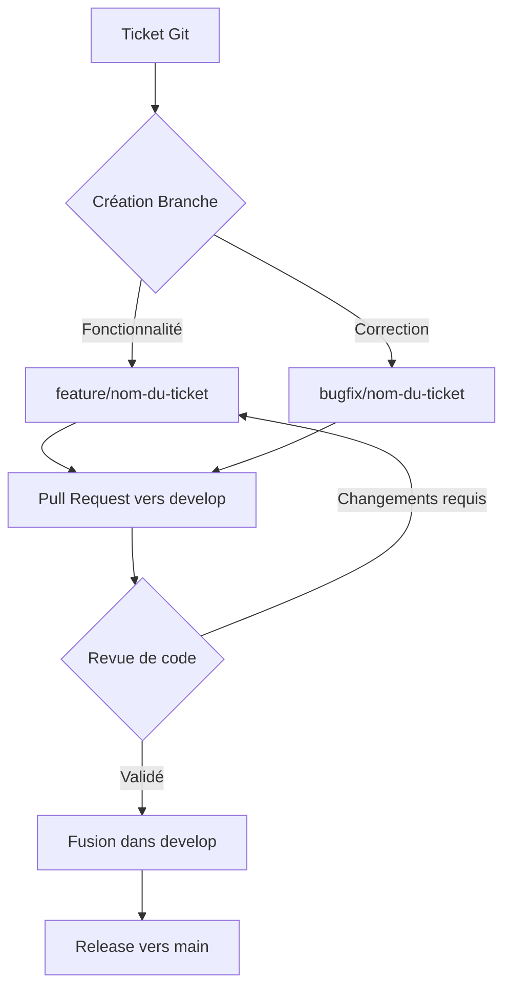

# StageConnect Frontend — RÉSUMÉ EXÉCUTIF 🚀

## Guide pour le développement de l'interface web

StageConnect est la plateforme camerounaise de référence pour la mise en relation pour les stages. Ce projet concerne le frontend web, destiné **uniquement aux entreprises et aux administrateurs**. Les étudiants utilisent exclusivement l'application mobile.

---

## 1. PROCESSUS DE CONTRIBUTION (GIT FLOW)

Nous utilisons une méthodologie rigoureuse basée sur les tickets et les Pull Requests pour garantir la stabilité de la branche principale.

### Schéma du flux de travail


### Étapes détaillées
1.  **Sélection du ticket** : Choisissez une tâche sur le tableau de bord Git.
2.  **Création de la branche** : Toujours partir de la branche `develop` la plus récente.
    ```bash
    git checkout develop
    git pull origin develop
    git checkout -b feature/ID-nom-du-ticket
    ```
3.  **Développement** : Travaillez sur votre branche. Effectuez des commits atomiques.
4.  **Pull Request (PR)** : Une fois terminé, soumettez votre code pour revue.
    *   **Cible** : La branche `develop`.
    *   **Contenu** : Description des changements et lien vers le ticket.
5.  **Revue & Validation** : Au moins une approbation est nécessaire. Les tests automatisés doivent passer.
6.  **Fusion (Merge)** : Une fois validée, la branche est intégrée à `develop`.
7.  **Branche main** : Réservée uniquement au code stable et prêt pour la production.

---

## 2. CONTEXTE GÉNÉRAL

**Points clés :**
- Une seule landing page publique.
- Authentification réservée aux entreprises et admins.
- Dashboards distincts pour entreprises et administrateurs.
- **Note importante** : Le système utilise une **sidebar unique** dont les éléments s'affichent dynamiquement selon le rôle de l'utilisateur.
- Style avec **Tailwind CSS**.
- Template dashboard : Inspiré de [TailAdmin](https://angular-demo.tailadmin.com/).

---

## 3. ARCHITECTURE TECHNIQUE

### Stack technique
```text
Frontend : Angular (dernière version LTS)
CSS Framework : Tailwind CSS
État : Services avec RxJS (BehaviorSubjects)
Authentification : JWT tokens
Routing : Lazy loading modules
```

### Structure de dossiers
```text
src/
├── app/
│   ├── core/               # Services, guards, intercepteurs
│   ├── shared/             # Composants réutilisables, directives, pipes
│   ├── layouts/            # Layouts (landing, dashboard avec sidebar dynamique)
│   ├── features/           # Modules fonctionnels
│   │   ├── landing/        # Landing page (publique)
│   │   ├── auth/           # Connexion, inscription entreprise
│   │   ├── entreprise/     # Dashboard entreprise
│   │   └── admin/          # Dashboard admin
│   └── app-routing.module.ts
```

---

## 4. GESTION D'ÉTAT ET DONNÉES

### Services avec RxJS
```typescript
@Injectable({ providedIn: 'root' })
export class OffreService {
  private offresSubject = new BehaviorSubject<Offre[]>([]);
  offres$ = this.offresSubject.asObservable();
  
  constructor(private http: HttpClient) {}
  
  getOffres() {
    return this.http.get<Offre[]>('/api/offres').pipe(
      tap(offres => this.offresSubject.next(offres))
    );
  }
}
```

### Guards & Sécurité
- **AuthGuard** : Vérifie la validité du token JWT.
- **RoleGuard** : Vérifie le rôle (entreprise ou admin) avant l'accès.

```typescript
@Injectable({ providedIn: 'root' })
export class RoleGuard implements CanActivate {
  constructor(private auth: AuthService, private router: Router) {}
  
  canActivate(route: ActivatedRouteSnapshot): boolean {
    const requiredRole = route.data['role'];
    if (this.auth.hasRole(requiredRole)) return true;
    this.router.navigate(['/auth/login']);
    return false;
  }
}
```

---

## 5. DASHBOARDS (SIDEBAR DYNAMIQUE)

Bien que les interfaces soient distinctes, elles partagent un layout commun où la sidebar s'adapte au rôle :

### Entreprise
- **Accueil** : KPIs (offres actives, candidatures), stats.
- **Gestion des offres** : Liste, recherche, création/édition.
- **Candidatures** : Suivi des postulants, changement de statut.
- **CVthèque** : Recherche de talents par compétences.
- **Profil** : Informations légales, upload logo/RCCM.

### Admin
- **Accueil** : Statistiques globales de la plateforme.
- **Validation** : Consultation et validation des documents RCCM des entreprises.
- **Utilisateurs** : Gestion de tous les comptes (activations/blocages).
- **Modération** : Contrôle des offres publiées.

---

## 6. MODÈLES DE DONNÉES (TYPES)

```typescript
export interface Entreprise {
  id: number;
  raisonSociale: string;
  rccm: string; // PDF obligatoire
  statut: 'attente' | 'actif' | 'rejeté';
}

export interface Offre {
  id: number;
  titre: string;
  missions: string[];
  competences: string[];
  statut: 'brouillon' | 'actif' | 'expiré';
}
```

---

## 7. BILINGUISME (FR/EN)

Le projet utilise un système de traduction maison ou `ngx-translate` :
- `i18n/fr.json` & `i18n/en.json`
- Switch de langue présent dans le header.

---

## 8. CALENDRIER DE RÉALISATION

| Sprint | Focus |
|--------|-------|
| Sprint 1 | Initialisation, landing page |
| Sprint 2 | Authentification, début dashboard entreprise |
| Sprint 3 | Dashboard entreprise (offres, candidatures) |
| Sprint 4 | Dashboard admin (validations, utilisateurs) |
| Sprint 5 | Fonctionnalités transversales, optimisations |
| Sprint 6 | Tests, corrections, déploiement |
| Final | Polissage UI, Remplacement médias (v1.1) |

---

## 9. ACCÈS DÉVELOPPEMENT (AUTHENTIFICATION)

Pour tester les différents tableaux de bord en local, utilisez les identifiants suivants :

### 👤 Administrateur
- **Email** : `active.user@stageconnect.com`
- **Mot de passe** : `Password123!`

### 🏢 Entreprise
- **Email** : `entreprise@stageconnect.cm`
- **Mot de passe** : `entreprise123`

---

## 10. POINTS D'ATTENTION (CAMEROUN)
- **Performance** : Design léger adapté aux connexions instables.
- **Mobile-First** : Expérience fluide sur tous les supports.
- **Numéros locaux** : Validation spécifique pour les numéros de téléphone camerounais.

---
© 2026 StageConnect.
